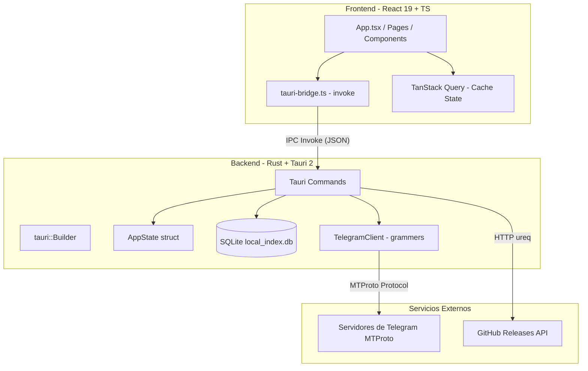

# Arquitectura del Sistema - Telegram Drive

Telegram Drive utiliza una arquitectura híbrida de aplicación de escritorio basada en **Tauri 2**. El frontend en React y TypeScript interactúa con un backend en Rust de alto rendimiento a través de comandos seguros IPC (Inter-Process Communication).

---

## Diagrama de Arquitectura



---

## Bindeo de Comandos e IPC (Tauri Bridge)

La comunicación se gestiona en [tauri-bridge.ts](file:///c:/Users/HuGOD777/proyectos%20prime/telegram%20drive/src/services/tauri-bridge.ts).
1. El frontend invoca comandos mediante nombres en formato `snake_case` (ej. `list_files`, `auth_verify_code`).
2. Rust procesa los argumentos y los serializa/deserializa automáticamente usando `serde` con la directiva `#[serde(rename_all = "camelCase")]` para adaptar los nombres de los campos de JS (`camelCase`) a Rust (`snake_case`).

---

## Flujos Clave paso a paso

### 1. Autenticación y Persistencia
```
Paso 1: [Frontend] Login Form (API ID, Hash, Teléfono) -> authLogin()
Paso 2: [Backend] conecta con Telegram usando la librería grammers.
Paso 3: [Backend] guarda las credenciales ingresadas en la tabla de configuración local (SQLite).
Paso 4: [Backend] solicita el código OTP de Telegram.
Paso 5: [Frontend] muestra input para ingresar el código OTP recibido.
Paso 6: [Frontend] envía código -> authVerifyCode() -> Backend verifica con grammers.
Paso 7: [Backend] si la verificación es exitosa, guarda la sesión de Telegram en `telegram.session`.
Paso 8: En futuros reinicios, authCheckSession() carga `telegram.session` y las credenciales desde SQLite para iniciar de forma automática.
```

### 2. Flujo de Archivos (CRUD)

* **Upload**:
  El frontend llama a `openDialog()` de Tauri para seleccionar los archivos locales. Luego, `upload_file(file_path)` sube el archivo al chat de "Mensajes Guardados" (`me`) del usuario de Telegram mediante grammers. Al completarse la subida, se inserta una fila en la base de datos SQLite con el ID del mensaje formateado como `{msg_id}@self` y se retorna el ID.
* **Download**:
  El frontend despliega el diálogo `save()` de Tauri para que el usuario seleccione la ruta de destino local. Luego invoca `download_file(file_id, dest_path)`. El backend extrae el `msg_id` a partir del `file_id`, obtiene el mensaje de Telegram y descarga los bytes directamente al destino.
* **Delete**:
  El backend extrae el `msg_id`, elimina el mensaje en Telegram a través de grammers y luego remueve el registro correspondiente en la base de datos SQLite y elimina el thumbnail local si existiera.
* **Rename**:
  Esta operación es puramente local. Se actualiza el nombre en la tabla `files` de SQLite mediante `rename_file(file_id, new_name)`. El mensaje y el archivo en los servidores de Telegram permanecen inalterados.
* **Sync (Sincronización)**:
  Se ejecuta `sync_files()`. El backend consulta los últimos mensajes de la conversación del usuario con él mismo ("Saved Messages") a través de grammers (limitado a los últimos 200 mensajes en la implementación actual). Itera los mensajes, detecta aquellos que contienen archivos adjuntos (documentos) que no existen en la base de datos SQLite local, los registra (inicialmente con `thumbnail_path = ''`), e invalida la query de React para reflejar los cambios.

---

## Base de Datos Local (SQLite)

Se utiliza para indexar localmente los metadatos de los archivos para permitir búsquedas y filtrados instantáneos sin consultar la API de Telegram constantemente.

### Schema (`schema.rs`)

1. **Tabla `files`**:
   * `id` (TEXT PRIMARY KEY): Formato `"{msg_id}@self"`.
   * `name` (TEXT NOT NULL): Nombre del archivo.
   * `size_bytes` (INTEGER NOT NULL): Tamaño en bytes.
   * `mime_type` (TEXT NOT NULL): Tipo MIME del archivo.
   * `folder_id` (TEXT NOT NULL DEFAULT 'self').
   * `telegram_file_id` (TEXT NOT NULL): Identificador único del archivo para descarga.
   * `created_at` (INTEGER NOT NULL): Timestamp Unix de creación.
   * `synced_at` (INTEGER NOT NULL): Timestamp de sincronización.
   * `is_encrypted` (INTEGER NOT NULL DEFAULT 0): Bandera de cifrado.
   * `thumbnail_path` (TEXT NOT NULL DEFAULT ''): Ruta absoluta en caché del thumbnail.

2. **Tabla `config`**:
   * `key` (TEXT PRIMARY KEY): Claves como `'api_id'`, `'api_hash'`, `'phone_number'`.
   * `value` (TEXT NOT NULL): Valor correspondiente.

### Índices de Rendimiento
* `idx_files_folder_id` en `files(folder_id)` para búsquedas rápidas en el directorio principal.
* `idx_files_created_at` en `files(created_at DESC)` para ordenamiento rápido por fecha descendente.
* Modo `PRAGMA journal_mode=WAL` y `PRAGMA foreign_keys=ON` habilitados para concurrencia segura.
